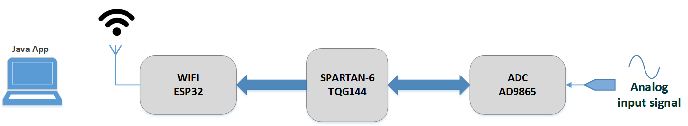
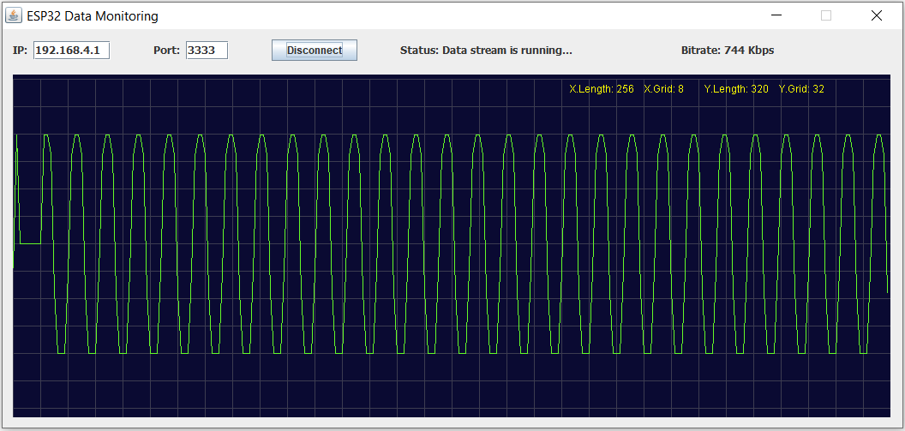

# 

 
This project consists of two Interfacing: FPGA Spartan-6 with an Analog Devices high-speed ADC (AD9865) and then transferring data through WIFI protocol by means of ESP32-WROVER module to the PC in which a Java application monitors the receiving data. 
The ADC AD9865 is driven with sample rate of 75MHz (75MSPS) with bitwidth of 10. The AD9865 chip is configured by Spartan through SPI connection in order to operate properly. The ADC data then is transferred to ESP32 which is configured in Access-Point mode. The PC is connected to ESP32 through Wifi. A graphical Java application has been developed to monitor the received data in waveform mode.  
[VHDL_code](SPARTAN6_PROJ_ISE/Top_Design.vhd) 
[ESP32_Firmware](esp32_workspace/ESP32_Eclipse_project/main/hello_world_main.c) 
[Java_program](Java_Application/src/ESP32_Stream.java) 

 
 

## Author:
### Hamid Reza Tanhaei

